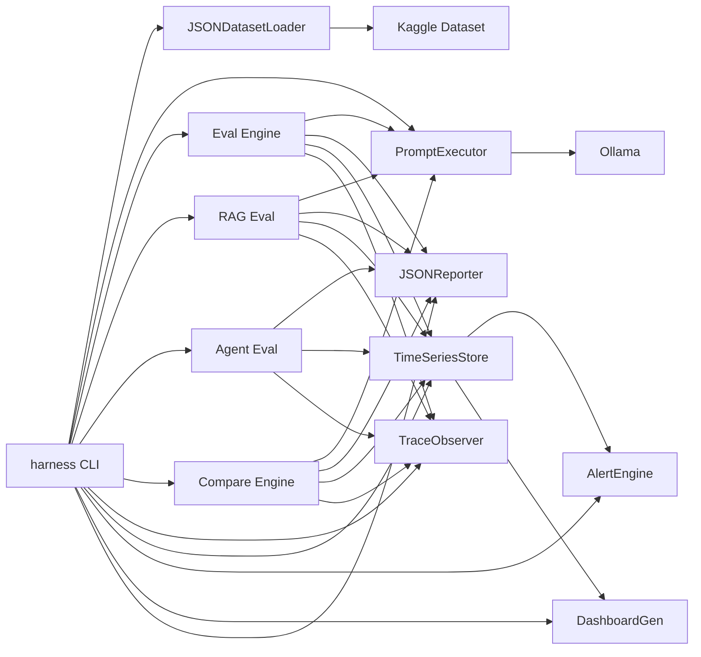

# AI Evaluation Harness

AI Evaluation Harness is an open-source framework designed to evaluate, validate, and monitor AI-powered systems.

The project aims to provide a structured and repeatable approach to AI Quality Engineering, helping teams assess the reliability and performance of:

* Large Language Models (LLMs)
* Retrieval-Augmented Generation (RAG) systems
* AI Agents
* AI Assistants
* Prompt-based applications

## Architecture



## Why This Project Exists

Traditional software testing relies on deterministic outputs and exact assertions.

AI systems behave differently.

The same input may produce multiple valid outputs, making conventional testing approaches insufficient.

AI Evaluation Harness aims to provide:

* Repeatable evaluations
* Objective quality metrics
* Regression detection
* Automated validation
* CI/CD integration

## Current Status

Project Stage: **Phase 7 Complete** — CI/CD Integration

### MVP (Prompt Evaluation)

| # | Milestone | Status |
| --- | ----------- | -------- |
| — | Contracts & Interfaces | ✅ Complete |
| M1 | Dataset Loader | ✅ Complete |
| M2 | Provider Interface (Ollama) | ✅ Complete |
| M3 | Prompt Executor | ✅ Complete |
| M4 | Evaluation Engine | ✅ Complete |
| M5 | Report Generator | ✅ Complete |
| M6 | CLI Entry Point | ✅ Complete |

### Phase 2 — RAG Evaluation

| # | Milestone | Status |
| --- | ----------- | -------- |
| R1 | DeepEval Integration | ✅ Complete |
| R2 | Context Provider | ✅ Complete |
| R3 | RAG Metrics (Faithfulness, Relevancy, Precision, Recall) | ✅ Complete |
| R4 | Context & Chunking Spec | ✅ Complete |
| R5 | End-to-End RAG Pipeline (`harness rag-eval`) | ✅ Complete |

### Phase 3 — Multi-Model Comparison

| # | Milestone | Status |
| --- | ----------- | -------- |
| C1 | Model Registry (`ModelSpec`) | ✅ Complete |
| C2 | Parallel Execution (`ThreadPoolExecutor`) | ✅ Complete |
| C3 | Comparison Report (side-by-side metrics, tokens, latency) | ✅ Complete |
| C4 | Cost & Latency Tracking | ✅ Complete |

### Phase 4 — Agent Evaluation

| # | Milestone | Status |
| --- | ----------- | -------- |
| A1 | Trajectory Capture (`AgentStep`, `AgentTrajectory`) | ✅ Complete |
| A2 | Step-Level Metrics (`StepCorrectness`) | ✅ Complete |
| A3 | Outcome Metrics (`GoalAchievement`) | ✅ Complete |
| A4 | Tool-Use Metrics (`ToolSelection`, `TrajectoryCoherence`) | ✅ Complete |

### Phase 5 — Observability & Monitoring

| # | Milestone | Status |
| --- | ----------- | -------- |
| O1 | Execution Tracing (`TraceObserver`) — captures evaluation events with timing, persists to NdJSON | ✅ Complete |
| O2 | Metric Time Series (`TimeSeriesStore`) — appends metric results with timestamps for trend analysis | ✅ Complete |
| O3 | Alert Rules (`AlertEngine`) — threshold-based alerting (gt/lt/gte/lte/eq) with default rules | ✅ Complete |
| O4 | Dashboard Templates (`DashboardGenerator`) — generates static HTML dashboards with summary cards, alerts, metric history, trends | ✅ Complete |

### Phase 6 — CORE Governance Integration

| # | Milestone | Status |
| --- | ----------- | -------- |
| G1 | Risk-Based Prioritization (`RiskClassifier`, 7 change types, risk formula, `--risk` flag) | ✅ Complete |
| G2 | Failure Escalation (`EscalationEngine`, severity gate map, 11 failure codes, `--gate` flag) | ✅ Complete |
| G3 | Prompt Regression Testing (`PromptRegistry`, F1-based `PromptRegressionMetric`, `harness prompt-regress`) | ✅ Complete |
| G4 | Red Team Security Evaluation (`RedTeamExecutor`, 3 default LLM attack tests, ASR tracking, `harness red-team`) | ✅ Complete |
| G5 | Operations Tooling (`harness override` stubs, `docs/rollback_checklist.md`) | ✅ Complete |
| G6 | Continuous Scheduling (`SchedulerEngine`, interval-based auto-eval, `harness scheduler`) | ✅ Complete |

### Phase 7 — CI/CD Integration

| # | Milestone | Status |
| --- | ----------- | -------- |
| C1 | GitHub Actions Workflow (`harness-eval.yml`) — runs eval/rag-eval/agent-eval on push and PR | ✅ Complete |
| C2 | PR Comment Reporting — posts evaluation summary as a PR comment via `actions/github-script` | ✅ Complete |
| C3 | Artifact Publishing — uploads reports, dashboards, and time series as build artifacts | ✅ Complete |
| C4 | Scheduled Regression Runs — cron workflow (Mon/Thu) with `workflow_dispatch` support | ✅ Complete |
| C5 | Status Badge (`BadgeGenerator`, `harness ci badge`) — generates shields.io-compatible SVG badge | ✅ Complete |

The full evaluation pipeline works end-to-end: **load dataset → execute prompts → evaluate metrics → generate report**.

### Upcoming Phases

| Phase | Focus | Status |
| ------- | ------- | -------- |
| Phase 8 | Extended Provider Support — Groq, OpenRouter, OpenAI, cost tracking | Planned |

## Target Audience

* AI Engineers
* QA Engineers
* Reliability Engineers
* Automation Engineers
* Software Engineers building AI systems

## Project Goals

* Standardize AI evaluation practices.
* Enable automated AI quality validation.
* Support multiple AI providers.
* Integrate seamlessly with CI/CD workflows.
* Promote explainable and observable evaluations.

## Documentation

| Document | Description |
| ---------- | ------------- |
| `CONTEXT.md` | Problem context and motivation |
| `docs/VISION.md` | Project vision and long-term goals |
| `docs/ARCHITECTURE.md` | High-level architecture overview |
| `docs/PLAN.md` | Scope and future phase roadmap |
| `docs/ROADMAP.md` | Milestones, timeline, and dependencies |
| `docs/DECISIONS.md` | Architecture decision records |
| `docs/EVALUATION_PRINCIPLES.md` | Core evaluation principles |
| `docs/DATASET_SPEC.md` | Dataset format specification |
| `docs/sdd.md` | Software Design Document (detailed) |
| `docs/testing_framework_overview.md` | Testing methodology for the harness |
| `docs/provider_interface.md` | Provider abstraction contract |
| `docs/metrics_spec.md` | Metric definitions and scoring |
| `docs/data_model.md` | Schemas and data contracts |
| `docs/rag_evaluation_strategy.md` | RAG evaluation strategy (Phase 2) |
| `docs/rollback_checklist.md` | Operational rollback procedure (Phase 6) |
| `.github/workflows/harness-eval.yml` | CI workflow — runs on push/PR (Phase 7) |
| `.github/workflows/harness-scheduled.yml` | Scheduled regression runs — cron + manual dispatch (Phase 7) |

## Relationship to AI QA Core Framework

This project follows the methodology defined in the AI QA Core Framework. The CORE framework provides the governing methodology, contracts, and skills; this project is the concrete implementation of an AI evaluation tool within that framework.

## Setup

### Prerequisites

a. Install Python 3.12+
b. PowerShell 7+ (Windows)

### Virtual Environment

```powershell
# Create virtual environment
python -m venv .venv

# Activate it
.\.venv\Scripts\Activate.ps1

# Install dependencies
pip install -r requirements.txt
```

> The `.venv` directory is git-ignored. Activate it before running any harness commands.

### Deactivate

```powershell
deactivate
```

## Package Structure

```bash
src/harness/
├── __init__.py
├── cli.py                # CLI entry point (argparse) — all commands
├── errors.py             # Shared error types
├── comparison.py         # ComparisonEngine, ModelSpec
├── evaluator.py          # EvaluationEngine
├── evaluator_rag.py      # RAGEvaluator
├── evaluator_agent.py    # AgentEvaluator
├── executor.py           # PromptExecutor
├── escalation.py         # EscalationEngine — severity gate map, failure codes
├── prompt_regression.py  # PromptRegistry, PromptRegressionMetric
├── ci.py                 # BadgeGenerator — shields.io SVG badge for CI/CD (Phase 7)
├── scheduler.py          # SchedulerEngine — interval-based continuous eval
├── contracts/            # Data contracts (dataclasses)
│   ├── dataset.py        # Dataset, DatasetEntry, DatasetMetadata, Difficulty
│   ├── execution.py      # ExecutionRequest, ExecutionResponse, TokenUsage, StreamChunk
│   ├── evaluation.py     # MetricResult, EvaluationResult, EvaluationSummary
│   ├── agent.py          # AgentStep, AgentTrajectory, AgentEvaluationInput
│   ├── rag.py            # Document, DocumentChunk, RAGEvaluationInput
│   ├── report.py         # Report, SummaryStats
│   ├── risk.py           # ChangeType, RiskLevel, RiskAssessment (CORE governance)
│   ├── security.py       # RedTestCase, RedTestResult, RedTestSummary (CORE governance)
│   └── trace.py          # ObservableEvent, Trace
├── interfaces/           # Abstract base classes
│   ├── dataset_loader.py # DatasetLoader (ABC)
│   ├── provider.py       # LLMProvider (ABC)
│   ├── metric.py         # Metric (ABC)
│   ├── reporter.py       # Reporter (ABC)
│   ├── observer.py       # Observer (ABC)
│   └── context_provider.py # ContextProvider (ABC)
├── loaders/              # Concrete dataset loaders
│   ├── __init__.py
│   └── json_loader.py    # JSONDatasetLoader
├── metrics/              # Concrete metric implementations
│   ├── __init__.py
│   ├── exact_match.py
│   ├── contains.py
│   ├── rag/              # DeepEval-wrapped RAG metrics
│   │   ├── __init__.py
│   │   ├── faithfulness.py
│   │   ├── answer_relevancy.py
│   │   ├── context_precision.py
│   │   └── context_recall.py
│   └── agent/            # Agent trajectory metrics
│       ├── __init__.py
│       ├── step_correctness.py
│       ├── goal_achievement.py
│       ├── tool_selection.py
│       └── trajectory_coherence.py
├── providers/            # Concrete LLM provider implementations
│   ├── __init__.py
│   ├── ollama.py
│   └── context.py
├── observers/            # Concrete Observer implementations
│   ├── __init__.py
│   └── trace_observer.py
├── observability/        # Monitoring & alerting
│   ├── __init__.py
│   ├── models.py         # MetricSnapshot, AlertRule, AlertResult
│   ├── store.py          # TimeSeriesStore — NdJSON metric history
│   ├── alerts.py         # AlertEngine — threshold-based alerting
│   └── dashboard.py      # DashboardGenerator — HTML dashboard
├── risk/                 # Risk-based prioritization (CORE governance)
│   ├── __init__.py       # RiskClassifier
├── red_team/             # Red team security evaluation (CORE governance)
│   ├── __init__.py       # RedTeamExecutor
└── reporters/            # Concrete report generators
    ├── __init__.py
    └── json_reporter.py
```

## Python Conventions

a. **Source code** goes under `src/harness/`
b. **Tests** go under `tests/`
c. **Contracts** (dataclasses) go under `src/harness/contracts/`
d. **Interfaces** (abstract classes) go under `src/harness/interfaces/`
e. **Dataset preparation scripts** go under `scripts/`
f. **Tests** go under `tests/`
g. Use `requirements.txt` for pinned dependencies (add as you go)

## CLI Usage

### Evaluation Commands

```powershell
# Standard evaluation (1456 QA entries, runs against phi3)
harness eval -d datasets/qa_kaggle.json -m phi3 --metrics exact_match contains --limit 5

# RAG evaluation (requires a dataset with context_documents in metadata)
harness rag-eval -d datasets/rag_dataset.json -m phi3 --metrics faithfulness answer_relevancy

# Agent trajectory evaluation (requires trajectory data in metadata)
harness agent-eval -d datasets/agent_dataset.json -m phi3 --metrics step_correctness goal_achievement

# Multi-model comparison
harness compare -d datasets/qa_kaggle.json --models phi3 llama3.2 --metrics exact_match contains --limit 5
```

> Use `--limit 5` for quick smoke tests. Omit it to run against all entries.

### Observability Commands (Phase 5)

After running evaluations, traces and time series data are automatically recorded to `.harness/traces/` and `.harness/timeseries.ndjson`.

```powershell
# Show latest metric scores from history
harness monitor status

# Evaluate default alert rules (Low Pass Rate, Score Drop, Tool Selection)
harness monitor alerts

# Generate an HTML observability dashboard
harness monitor dashboard -o dashboard.html

# Open the dashboard
start dashboard.html
```

### CI/CD Commands (Phase 7)

```powershell
# Generate a shields.io-compatible status badge from the latest metric snapshot
harness ci badge --store .harness/timeseries.ndjson --label "pass rate" -o badge.svg
```

### CORE Governance Commands (Phase 6)

```powershell
# Risk-based evaluation (classify change, set risk tolerance)
harness eval -d datasets/qa_kaggle.json -m phi3 --limit 5 --risk major --risk-threshold 0.7

# Failure escalation gate (reject evaluations below severity threshold)
harness eval -d datasets/qa_kaggle.json -m phi3 --limit 5 --gate warning

# Same for RAG and Agent evaluation
harness rag-eval -d datasets/rag_dataset.json -m phi3 --metrics faithfulness --gate error
harness agent-eval -d datasets/agent_dataset.json -m phi3 --metrics step_correctness --gate critical

# Prompt regression testing (compare against registered baseline)
harness prompt-regress -d datasets/qa_kaggle.json -m phi3 --limit 10

# Red team security evaluation (3 default LLM attack tests)
harness red-team -d datasets/qa_kaggle.json -m phi3 --limit 5

# Override management (stubs)
harness override request --change-type major --reason "Refactor evaluator"
harness override list
harness override approve <request-id>
harness override reject <request-id>

# Continuous evaluation scheduling
harness scheduler add --name nightly --interval 3600 --command "harness eval -d datasets/qa_kaggle.json -m phi3 --limit 5"
harness scheduler list
harness scheduler run --name nightly
```

### Full Pipeline (end-to-end)

```powershell
# 1. Run tests
pytest tests/ -v

# 2. Quick eval (5 entries)
harness eval -d datasets/qa_kaggle.json -m phi3 --limit 5

# 3. Check results
harness monitor status

# 4. Generate dashboard
harness monitor dashboard -o dashboard.html

# 5. Generate status badge for CI
harness ci badge -o badge.svg
```

## Running Tests

```powershell
.\.venv\Scripts\Activate.ps1
pytest tests/ -v
```

## License

MIT
